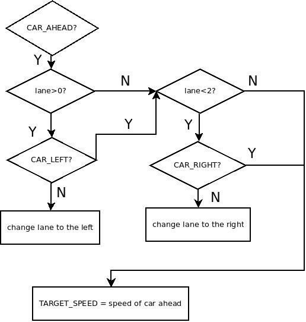
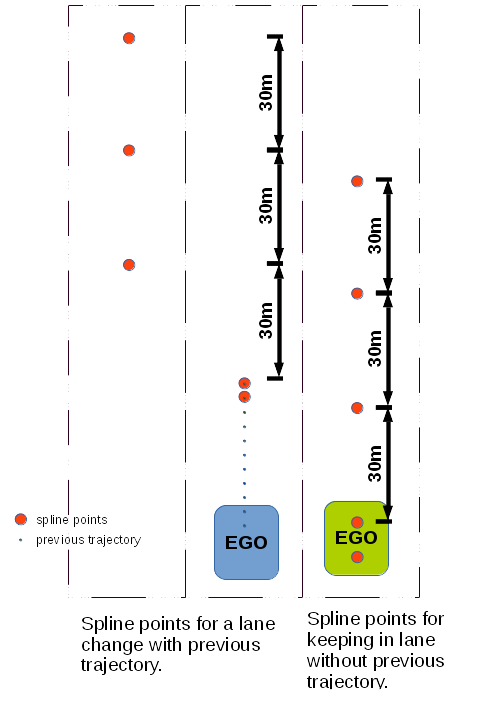

# CarND-Path-Planning-Project
Self-Driving Car Engineer Nanodegree Program
   
## Project Goal
The goal of this project was to safely navigate around a virtual highway with other traffic that is driving +-10 MPH of the 50 MPH speed limit. The inputs are:

 * the car's localization;
 * sensor fusion data (location and velocity data from other cars);
 * a sparse map list of waypoints which describe the highway's path

The car should try to go as close as possible to the 50 MPH speed limit, which means passing slower traffic when possible. The car should avoid hitting other cars at all cost as well as driving inside of the marked road lanes at all times, unless going from one lane to another. The car should be able to make one complete loop around the 6946m highway. Since the car is trying to go 50 MPH, it should take a little over 5 minutes to complete 1 loop. Also the car should not experience total acceleration over 10 m/s^2 and jerk that is greater than 10 m/s^3.


## Considerations

1. The car uses a perfect controller and will visit every (x,y) point it recieves in the list every .02 seconds (50H<). The units for the (x,y) points are in meters and the spacing of the points determines the speed of the car. The vector going from a point to the next point in the list dictates the angle of the car. Acceleration both in the tangential and normal directions is measured along with the jerk, the rate of change of total acceleration. The (x,y) point paths that the planner receives should not have a total acceleration that goes over 10 m/s^2, also the jerk should not go over 50 m/s^3. 

2. There will be some latency between the simulator running and the path planner returning a path, with optimized code usually its not very long maybe just 1-3 time steps. During this delay the simulator will continue using points that it was last given, because of this its a good idea to store the last points used to achieve a smooth transition. previous_path_x, and previous_path_y are helpful for this transition since they show the last points given to the simulator controller with the processed points already removed. 


## Implementation

The implementation is divided into 3 section:

 - **Making sense of other cars** where the processing of sensor fusion data is explained;
 - **Decision making** where the logic and strategies for the vehicle's decisions are presented;
 - **Trajectory generation** where the process of generating points for the trajectory the vehicle will follow is documented.


### Making sense of other cars

One of the first things to do on a new iteration is to process information about what the car is sensing on the road.
In particular, to make sense of the other cars driving in the same direction as the ego vehicle.
A `Car` class was implemented to make this an easier task work on.

Each time a new car is spotted, it's added to an internally kept `Car` library.
This way we can keep track of data about other cars from past iterations, if we wish.
When a car's location is updated, its current lane is automatically computed as well.
When a car's velocities are updated, its absolute velocity and corresponding MPH conversion are also computed.

With these data on hand, two sets of data are computed: 
 * the flags for warning of a car ahead, to the left or to the right;
 * the speed of each lane.

#### Flagging cars around ego vehicle


For each sensed car we predict what will be its location in the future.
How far in the future coincides with how many points in the past trajectory were left "unconsumed".
As an example, let us consider that 40 points of the previous trajectory were not consumed.
Trajectory points are consumed with a frequency of 50Hz (or every 0.02s).
We will predict where the car will be in 0.8s (40 * 0.02s).
If this future location is ahead and within 30m of the current location of the ego vehicle, then we consider there is a car ahead.
In the figure above the red ball corresponding to the predicted car location should be inside a painted area to activate its corresponding flag.
It should be noted that we're only considering the `s` component of Frenet coordinates of both vehicles.

A similar approach is taken for the car to the left and to the right flags.
This time, however, we consider 30m ahead and 15m behind the ego vehicle.
These three flags will be referred to as `CAR_AHEAD`, `CAR_LEFT` and `CAR_RIGHT` for the remainder of the document.

The code implementing the flags is shown below.
`future_loc` is the predicted position of the car.
`car_s` is the the ego vehicle's location along the road (Frenet coordinates).
`SAFETY_DIST` is the safety distance to use - it was set to 30m.


```C
if ( (cars[i].lane == lane) && future_loc[0] > car_s && 
     ((future_loc[0] - car_s) < SAFETY_DIST)){
  is_car_ahead = true;
  car_ahead = cars[i];
}
// if car is on left
else if ( (cars[i].lane == lane-1) &&
          future_loc[0] >= car_s - SAFETY_DIST/2 &&
          future_loc[0] <= car_s + SAFETY_DIST){
  is_car_left = true;
  car_left = cars[i];
}
// if car is on right
else if ( (cars[i].lane == lane+1) &&
          future_loc[0] >= car_s - SAFETY_DIST/2 &&
          future_loc[0] <= car_s + SAFETY_DIST){
  is_car_right = true;
  car_right = cars[i];
}
```

## Lane speeds


Computing the lane speed is useful when deciding to which lane we want to change to.
A simple strategy was used. 
We look ahead 100m of the ego vehicle.
If there is a car within those 100m, than the lane speed will be that vehicle's speed.
If there are multiple cars within that area, the speed of the car closest to the ego vehicle will be used.
If there are no cars within the area in a certain lane, that lane's speed is the `GOAL_SPEED`.


### Decision making
The problem at hand didn't require complex decision making to hit all criteria. We want to move as fast as possible in a legal (observing speed limit and keeping within lane limits), safe (avoiding collisions) and confortable manner (not accelerating or jerking hard).
Legality and safety are addressed in this section. Keeping lane limits and confort are addressed in the trajectory generation section.

Before going on about decision making, some considerations about the implementation must be introduced. 
The maximum speed that the car will ever drive (henceforth referred to as the `GOAL_SPEED`) is 49.5 MPH, just under the legal limit of 50 MPH.
That is the desired speed at any given time.
If it is not possible to drive at that speed, we want to drive at another legal, safe speed, henceforth referred to as `TARGET_SPEED`.
`TARGET_SPEED` is, then, our goal whenever `GOAL_SPEED` is not possible.
The reference speed (`REF_SPEED`) is the real speed the car will be driving.
In the beginning `REF_SPEED` is 0 since the car is stopped in the highway.
Overtime, it will gradually rise or fall given a `TARGET_SPEED`, always respecting the maximum acceleratons constraints.

| --------- | -------- |
| `REF_SPEED` | actual speed the car's controller will implement |
| `TARGET_SPEED` | speed the controller is working torwards |
| `GOAL_SPEED` | ideal speed, always 49.5 MPH |




The decision making implemented is very simple.
No cost functions were used as the decisions to be made were limited to speed changes and lane changes based on the other vehicles on the road.
These decisions can be effectively implemented with a simple flow described below.

In essence, our vehicle is always on a _keep lane_ state, except when it detects a vehicle ahead.
Then we could say it would assume a _change lane left_ or _change lane right_ state.
This is, however, an abstraction as no state machine was actually implemented.

Whenever `CAR_AHEAD` is active, try to change lanes.
If ego vehicle is not in the leftmost lane and `CAR_LEFT` is inactive, change to the left lane.
If ego vehicle is not in the rightmost lane and `CAR_RIGHT` is inactive, change to the right lane.
If lane change is not possitle, set the `TARGET_SPEED` to the speed of the vehicle ahead.
In future iterations `CAR_AHEAD` will continue to be activated since the distance from the ego vehicle to the car ahead will have shortened during the desacceleration.

The relevant code of the decision making process is shown below.

```C
if (is_car_ahead){
  if (lane > 0 and !is_car_left){ // try changing to left first
    lane--;
  }
  else if (lane < 2 and !is_car_right){ // try changing to right
    lane++;
  }
  else{ // if lane change not possible, set target speed to car ahead 
    TARGET_SPEED = car_ahead.v_mph - FAST_ACC;
  }
} // end if car is in my lane
```


It is also within the decision making portion of the code that a confortable speed transition is guaranteed.
If `REF_SPEED` is over the `TARGET_SPEED` by more than the acceleration limit, reduce speed by that amount.
If `REF_SPEED` is under the `TARGET_SPEED` by more than the acceleration limit, increase speed by that amount.
The change in speed is 0.4250 MPH, corresponding to an acceleration of 9.5 m.s^2.

```C
if (ref_speed - TARGET_SPEED > FAST_ACC){
  ref_speed -= FAST_ACC;
}
else if(ref_speed - TARGET_SPEED < - FAST_ACC){
  ref_speed += FAST_ACC;
}
```

### Trajectory generation
The created trajectories always have 50 points.
This means we generate a trajectory for 1s into the future.
At our `GOAL_SPEED` of 49.5 MPH, this translates to around 22m.
The "unconsumed" points from the previous trajectory are all used.
This ensures smoothness on lane changes and speed transitions.

The spline library was used to generate the trajectories.
We feed it points and it supplies a function that guarantees that all supplied points belong to its domain.

The trajectory generation section of the code starts by checking if there are at least 2 points from the previous path left "unconsumed".
If that is not the case (as in the beginning of the simulation), then we start creating a path from the the current position of the ego vehicle.
The current position and a prediction into the past based on current velocity are added to the spline.
If we have 2 or more points from the previous trajectory, then we start creating a path from the end of the previous path.
In this case, the last 2 points are added to the spline.
```C
if (prev_size < 2){
  double prev_car_x = car_x - cos(car_yaw);
  double prev_car_y = car_y + sin(car_yaw);

  ptsx.push_back(prev_car_x);
  ptsx.push_back(car_x);

  ptsy.push_back(prev_car_y);
  ptsy.push_back(car_y);

}
else {
  ref_x = previous_path_x[prev_size-1];
  ref_y = previous_path_y[prev_size-1];

  double ref_x_prev = previous_path_x[prev_size-2];
  double ref_y_prev = previous_path_y[prev_size-2];

  ref_yaw = atan2(ref_y - ref_y_prev,
                  ref_x - ref_x_prev);  // arctan

  ptsx.push_back(ref_x_prev);
  ptsx.push_back(ref_x);

  ptsy.push_back(ref_y_prev);
  ptsy.push_back(ref_y);
}
```

Then we add 3 more points to the spline, spaced 30m apart.
These points will either be on the current lane or on another lane if a lane change is to be performed.

```C
for(int i=1; i<=3; i+=1){
  double next_s = car_s + i*30;  // 30m steps
  double next_d = 2 + 4 * lane;
  vector <double> p = getXY(next_s, next_d, map_waypoints_s, map_waypoints_x, map_waypoints_y);
  ptsx.push_back(p[0]);
  ptsy.push_back(p[1]);
}
```



Before being added to the spline, all selected points are transformed such that the ego vehicle is at the origin (translation) and is pointing directly at the `x` axis (rotation).

We then use the spline to compute the future points and add them to the next points list.
On the first iteration we will be adding 50 points since there are no points from a previous trajectory.
Afterwards, less than 10 points are usually added.
Before adding the points to the next points list, we have to undo the transformation (translation and rotation).

The points generated from the spline are spaced from each other such that the speed is `REF_SPEED`.
This is an approximation, however.
The spacing is based on the hypotenuse from the first point of the spline to a point 30m ahead.
In reality, the path is a polynomial.
In this project this approximation works fine, but contexts where maneuvers with sharp turn angles happen this approximation might exceed acceleration limits.


```C
for (int i=0; i<=n_wps-prev_size; i++){
  double N = target_dist / (0.02 * ref_speed / 2.24);
  double x_point = x_add_on  + (target_x) / N;
  double y_point = s(x_point);

  x_add_on = x_point;

  double x_ref = x_point;
  double y_ref = y_point;

  // undo rotation
  x_point = x_ref * cos(ref_yaw) - y_ref * sin(ref_yaw);
  y_point = x_ref * sin(ref_yaw) + y_ref * cos(ref_yaw);

  // undo shift
  x_point += ref_x;
  y_point += ref_y;

  next_x_vals.push_back(x_point);
  next_y_vals.push_back(y_point);
}
```


## Results
Over 6.10 miles, 7 minutes and 44 seconds and 4709 readings, the average speed was 47.53 MPH.
The performance of the car can be observed in the following video.

[Youtube video](https://www.youtube.com/watch?v=zb0H-bjDqC0)

There are situations where the vehicle could perform lane changes to a faster lane, but does not because there is a car on that lane nearby, even though there is anouth space to perform a safe maneuver.
The activation of the `CAR_LEFT` and `CAR_RIGHT` flags are perhaps too strict and could be relaxed.


## Improvements
Although implemented, the lane speeds ended up not being used.
Instead of always trying to change to the left first, we should try to change to the fastest adjacent lane first.
We could also implement a more tiered planner where the vehicle changes to one lane just to get to the fastest lane.

To ensure the vehicle never exceeds the acceleration limits, the trajectory can be checked _a posteriori_.
If the spacing of the points is such that the limits are exceeded, it means the hypotenuse approximations has failed.
A solution to this is to break the 30m range into smaller intervals such that the hypotenuse of each interval is closer to the spline polynomial.


